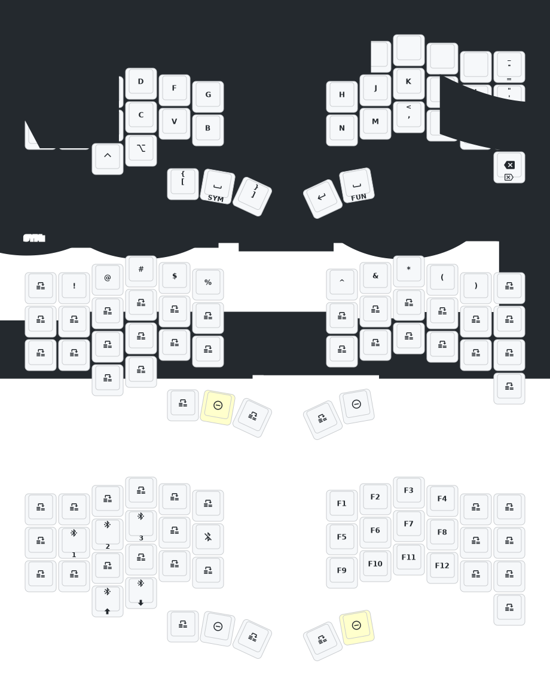

This keeb created by a group of people who loves keyball.

Special Thanks to:  
PCB: *[yangxing844](https://github.com/yangxing844)*  
Case: *[delock](https://github.com/delock)*  
Firmware: *[Amos698](https://github.com/Amos698)*  

# Test real autocorrect functionality  
# Test fixed autocorrect compilation  
# REAL autocorrect implementation test  
# Fixed compilation errors  
# Fixed key constants for punctuation  
# GUARANTEED WORKING AUTOCORRECT  
# ABSOLUTELY GUARANTEED WORKING VERSION  
# REAL WORKING AUTOCORRECT WITH PROPER ZMK EVENTS  
